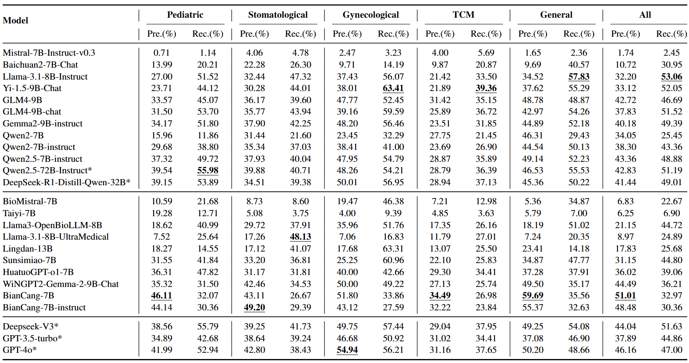
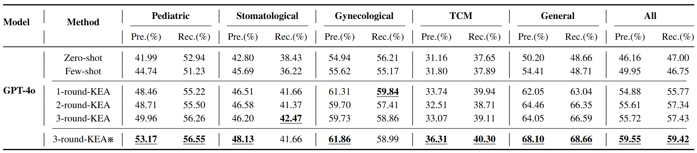
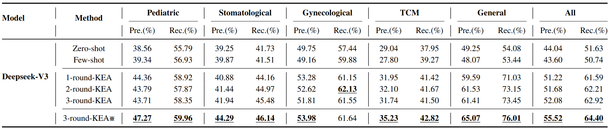
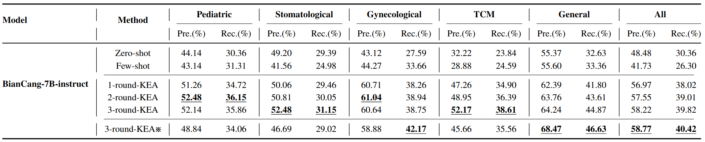
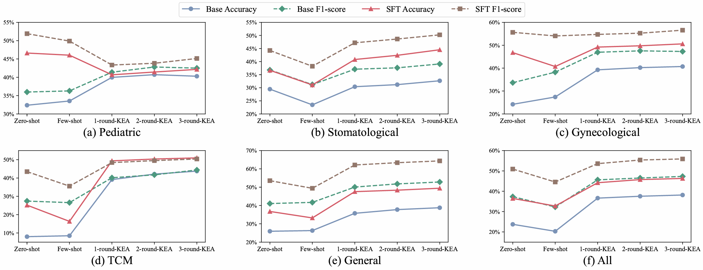
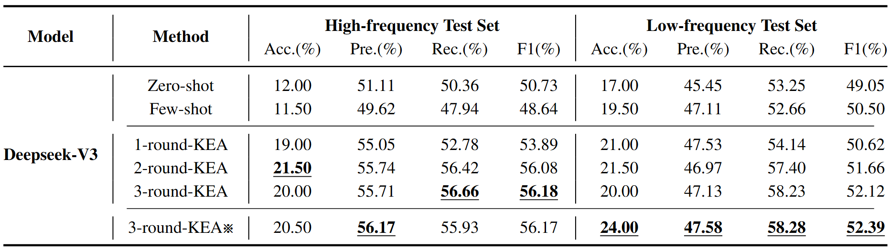
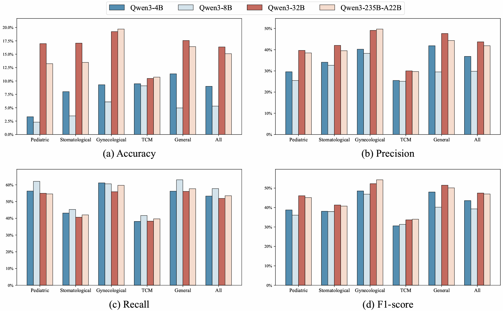
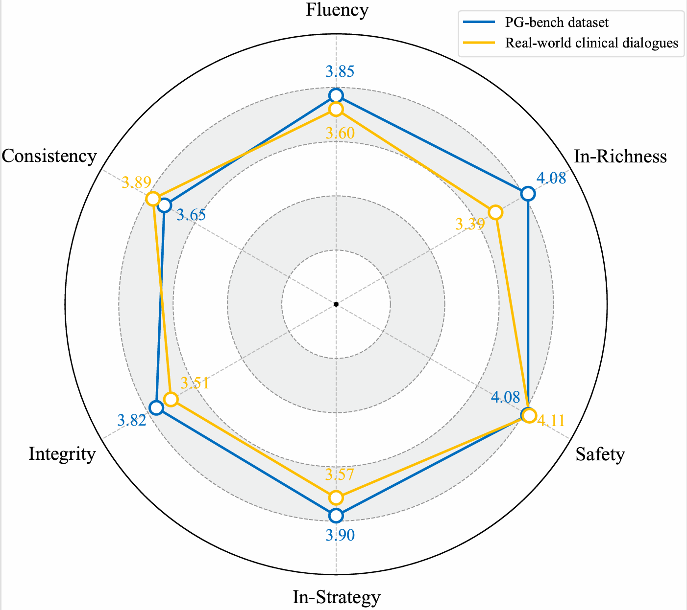

## 📊 Supplementary Benchmark Results

## ✨ Supplementary KEGA Performance

## 🛠️ Fine-Tuning Results

## 🧭 Evaluation of Distribution Shift and Retrieval Robustness

## 🤖 Qwen3 Evaluation

## 👨‍⚖️ Human Evaluation

