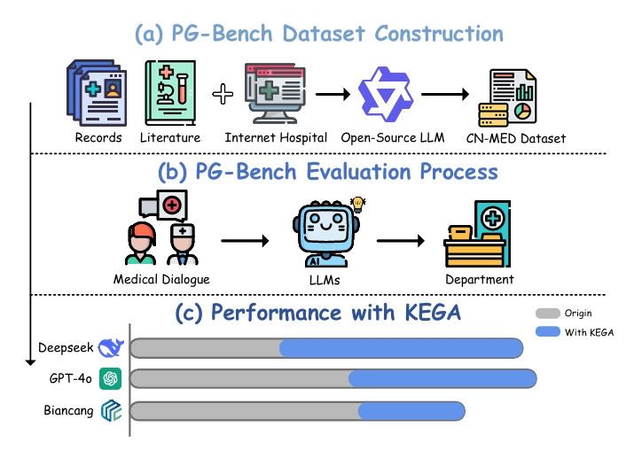
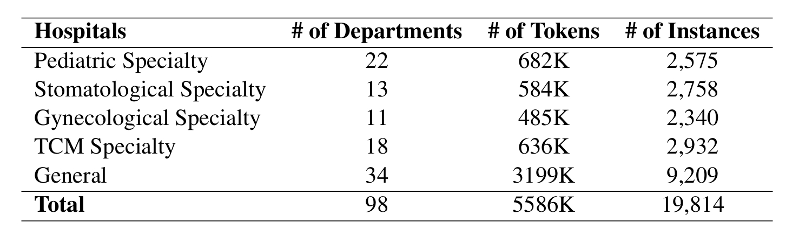
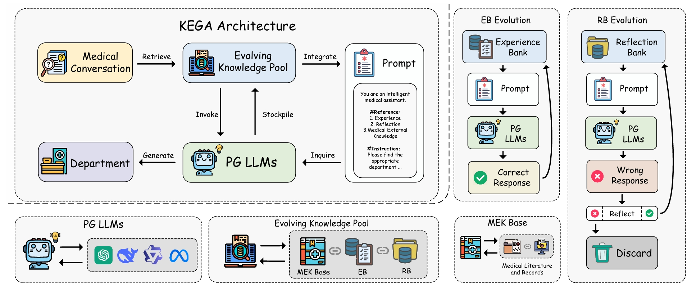
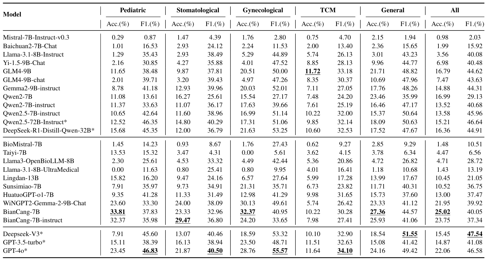
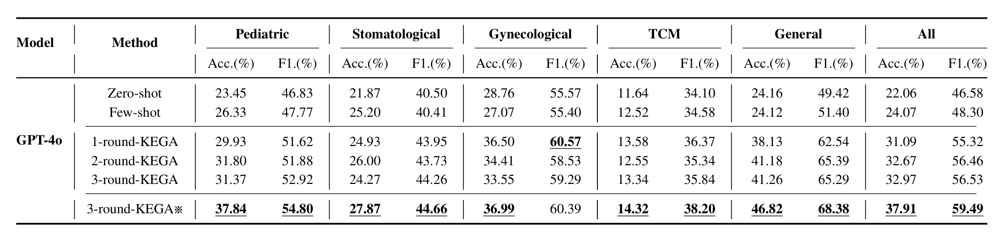
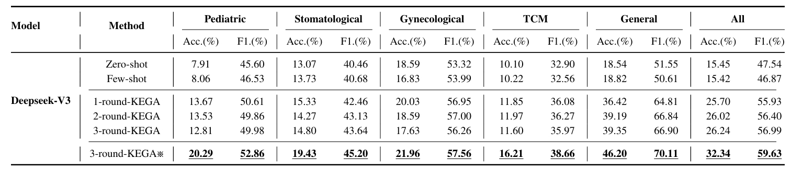
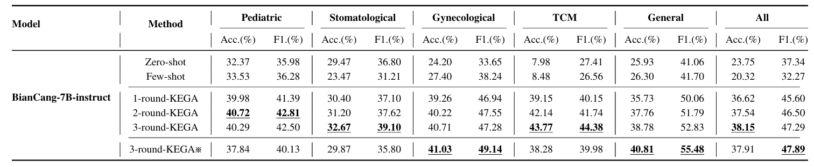

# CCPG Benchmark (PG-Bench) & KEGA 
<p float="left"> 

This repository serves as an open-source repository for the **CCPG benchmark (PG-Bench) and KEGA**, housing open-source datasets, model weights, and source code, and is the implementation of the paper "Advancing Conversation-based Chinese Patient Guidance with A New Benchmark and Knowledge-Evolvable Guidance Assistant".




## 📂 Dataset Overview


### PG-Bench Dataset
- **General.jsonl** - General Hospital Patient-Doctor Dialogue Guidance Dataset
- **Gynecological.jsonl** - Gynecological Specialty Hospital Patient-Doctor Dialogue Guidance Dataset
- **Pediatric.jsonl** - Pediatric Specialty Hospital Patient-Doctor Dialogue Guidance Dataset  
- **Stomatological.jsonl** - Stomatological Specialty Hospital Patient-Doctor Dialogue Guidance Dataset
- **TCM.jsonl** - TCM Specialty Hospital Patient-Doctor Dialogue Guidance Dataset

## 🧠 KEGA Architecture


## 📊 Benchmark Results
For more detailed benchmark results, please [Click here]()


## ✨ KEGA Performance
For more detailed performance results, please [Click here]()




## 📖 Usage
You can implement our methods according to the following steps:

1. Install the necessary packages. Run the command:
   ```
   pip install -r requirements.txt
   ```
2. Install Swift to deploy models. Please [Click here](https://swift.readthedocs.io/zh-cn/latest/index.html)
3. Run our code using Python.
   
   Train the KEGA
   ```
   python KEGA_train.py
   ```
   Evaluate the KEGA
   ```
   python KEGA_test.py
   ```
   Zero-Shot Testing
   ```
   python zeroshot.py
   ```
   Few-Shot Testing
   ```
   python fewshot.py
   ```

## 🌟 Contributions and suggestions are welcome!
