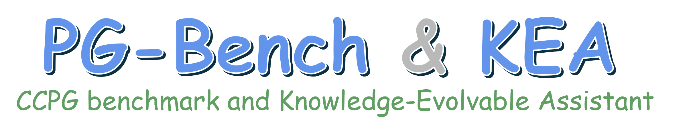

<p float="left"> 
   
# PG-Bench & KEA

This repository provides the official implementation of the paper **"Advancing Chinese Conversation-based Patient Guidance with a Benchmark and Knowledge-Evolvable Assistant."** It contains the open-source **PG-Bench dataset**, source code, experimental results, and usage instructions, supporting reproducible research and further development on the **CCPG benchmark (PG-Bench)** and the **Knowledge-Evolvable Assistant (KEA)**. *CCPG: Chinese Conversation-based Patient Guidance*.

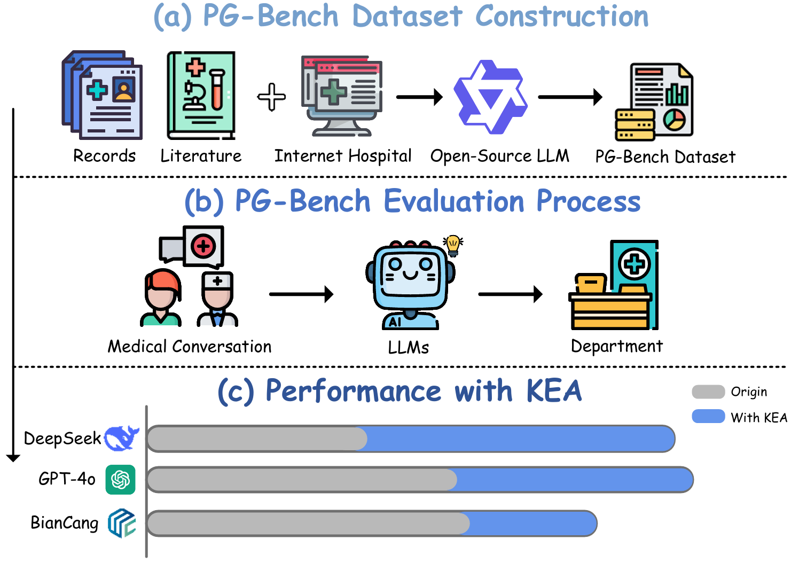


## 📂 Dataset Overview
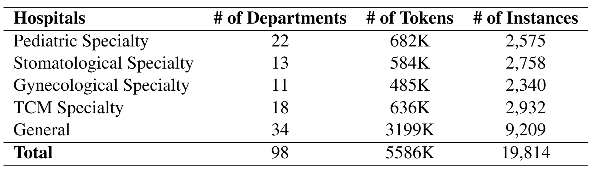

### PG-Bench Dataset
- **General.jsonl** - General Hospital Patient-Doctor Dialogue Guidance Dataset
- **Gynecological.jsonl** - Gynecological Specialty Hospital Patient-Doctor Dialogue Guidance Dataset
- **Pediatric.jsonl** - Pediatric Specialty Hospital Patient-Doctor Dialogue Guidance Dataset  
- **Stomatological.jsonl** - Stomatological Specialty Hospital Patient-Doctor Dialogue Guidance Dataset
- **TCM.jsonl** - TCM Specialty Hospital Patient-Doctor Dialogue Guidance Dataset

## 🧠 KEA Architecture
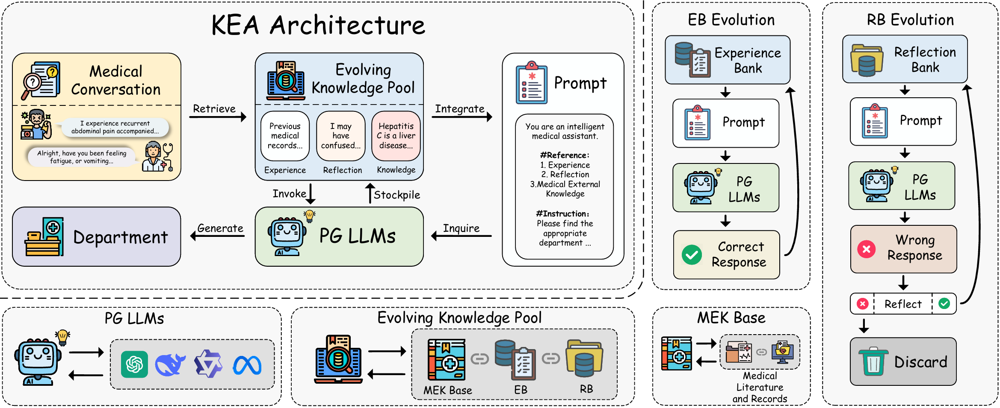

## 📊 Benchmark Results
For more detailed benchmark results, please [Click here](Doc/Supplementary%20Experiments/README.md)
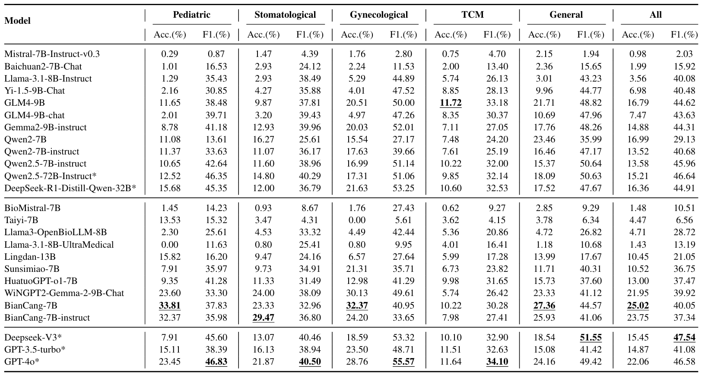

## ✨ KEA Performance
For more detailed performance results, please [Click here](Doc/Supplementary%20Experiments/README.md)
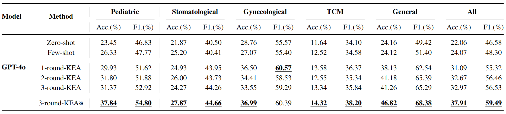
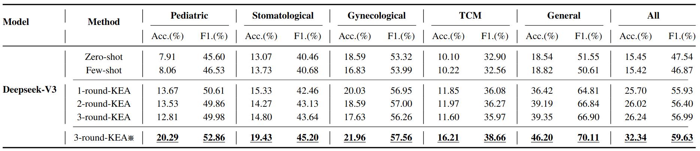
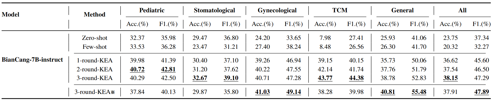

## 🔍 Case Study
- A case study of KEA utilizing EKP to recommend the appropriate department. EKP: Evolving Knowledge Pool.
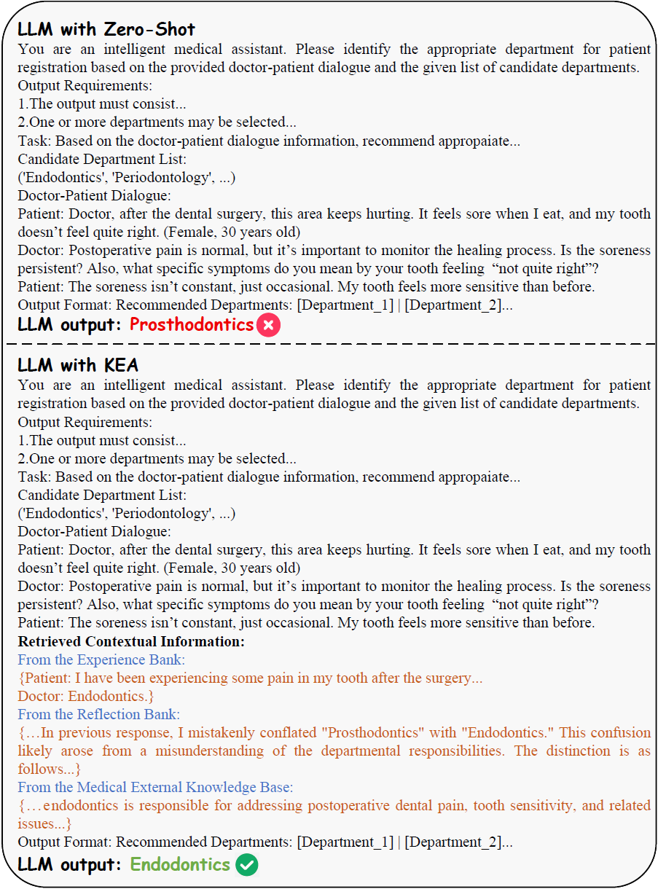


## 📝 Prompt Templates
- PG-Bench Dataset Construction Template and Prompt Instructions.
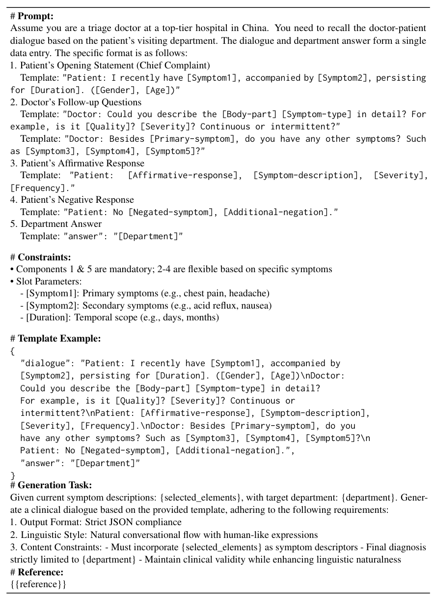

- System Prompt Instructions for PG-Bench.
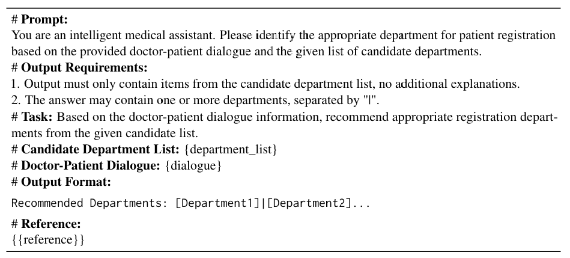

- System Prompt Instructions for KEA.


- Reflection Process Prompt Instructions for KEA.
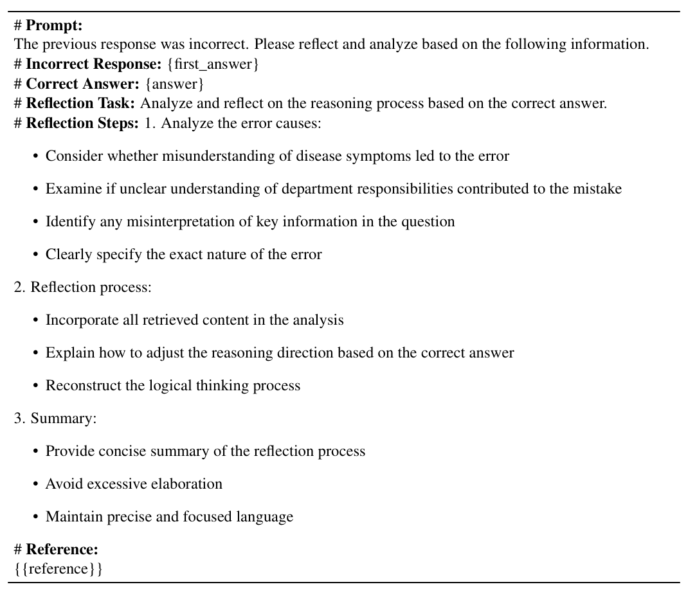

- Reflection-Based Response Prompt Instructions for KEA.
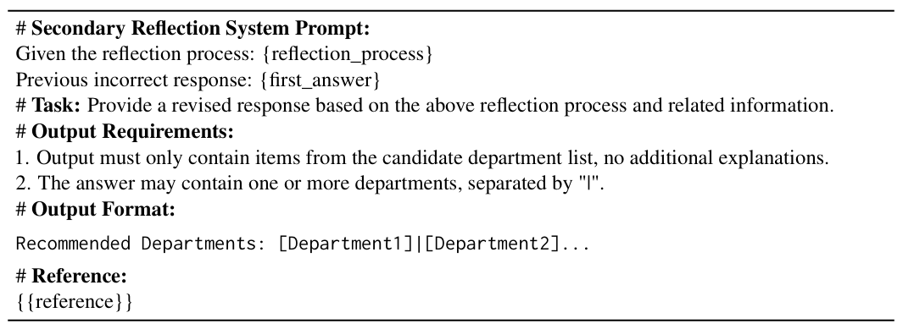

## 🏥 Departments List
- Description of the List of Subordinate Departments within the PG-Bench Dataset Subsets.
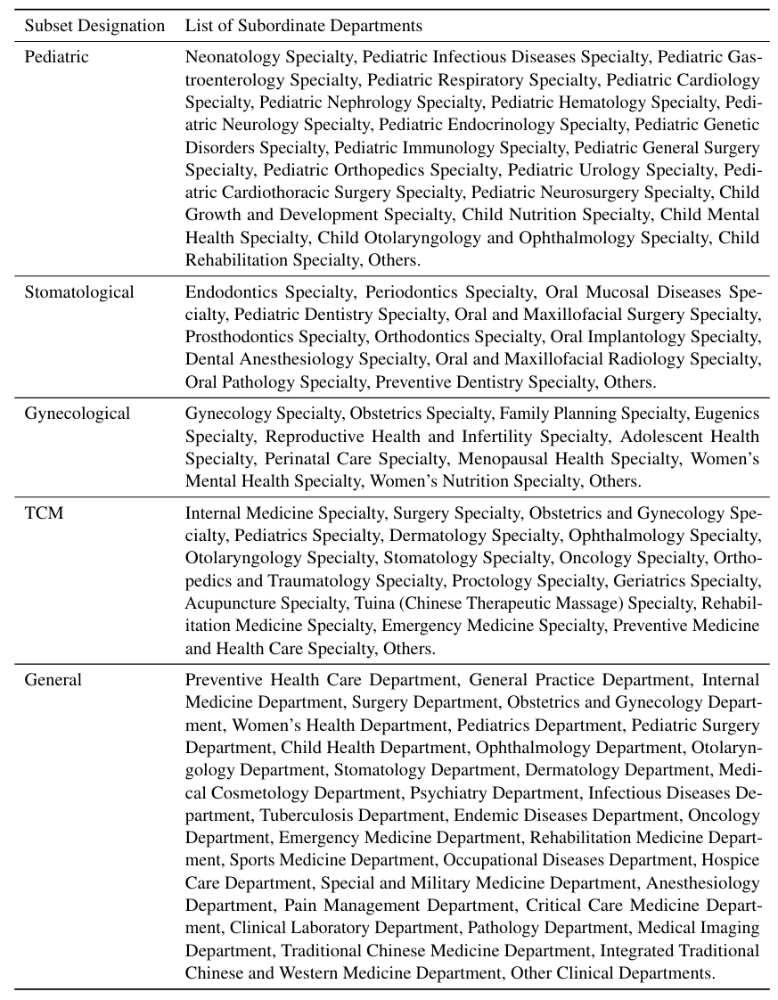


## 📖 Usage
You can implement our methods according to the following steps:

1. Install the necessary packages. Run the command:
   ```shell
   pip install -r requirements.txt
   ```
2. Install Swift to deploy models. Please [Click here](https://swift.readthedocs.io/zh-cn/latest/index.html)
3. Run our code using Python.
   
   Train the KEA:
   ```shell
   python KEA_train.py
   ```
   Evaluate the KEA:
   ```shell
   python KEA_test.py
   ```
   Zero-Shot Testing:
   ```shell
   python zeroshot.py
   ```
   Few-Shot Testing:
   ```shell
   python fewshot.py
   ```

## 🌟 Contributions and suggestions are welcome!
